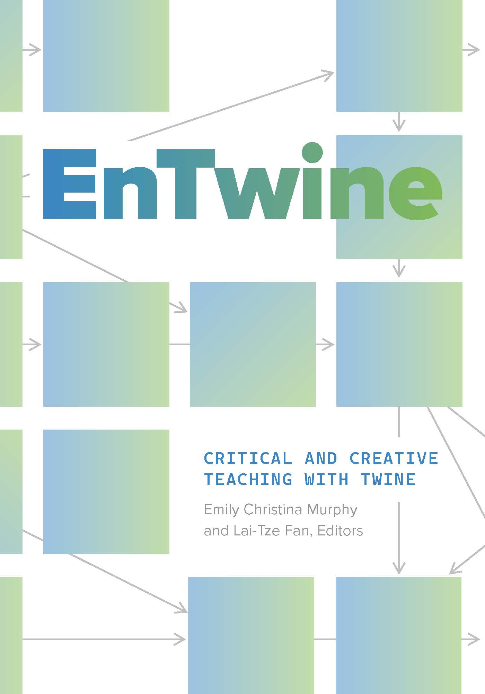

# Find all the GitHub resources for the collection _EnTwine_ here!

At the links below you'll find all repository material that accompanies the collection, _EnTwine: Critical and Creative Teaching With Twine_, published by Amherst College Press and co-edited by Emily Christina Murphy and Lai-Tze Fan in 2026. Links to these materials are also found in the print and open-access copies of the collection. 

You are free to fork, download, adapt, and use these resources. Amherst College Press material is published under a <a href="https://creativecommons.org/licenses/by-nc/4.0/">Creative Commons Attribution-Non Commercial license</a>. The repositories linked here will stay static, and individual authors may maintain and update their own repositories with more recent materials. We encourage you to go see what they're up to! As always, contributing back and crediting other instructors is greatly appreciated. 

<h2>Section 1</h2>

Object 1: <a href="https://github.com/EnTwine-Collection/Section1_JessicaLinker_TurtleStory">Jessica C. Linker’s <i>Turtle Story</i></a> 

Object 2: Jason Boyd’s Adaptation of Aesop’s “The Crow and the Pitcher” 

<h2>Section 2</h2>

Object 1: <a href="https://github.com/EnTwine-Collection/Section3_EmilyKJohnsonAndAnneSullivan_BeadEDAdventures">Emily K. Johnson and Anne Sullivan’s <i>BeadED Adventures</i></a> 

Object 2: <a href="https://github.com/EnTwine-Collection/Section2_JordanSterlingPike_GrandGouldingHotel">Jordan Sterling Pike’s <i>The Grand Goulding Hotel</i><a/> 

<h2>Section 3</h2>

Object 1: <a href="https://github.com/EnTwine-Collection/Section3_ChrisKerslake_ShyongQuinYap_ScienceAlive">Science AL!VE’s Teaching with Twine Workshop for High School Teachers by Chris Kerslake and Shyong Quin Yap</a> 

Object 2: Jaime Simons’s Empower Museum Learning with Twine! 

Object 3: Calvin Olsen’s Twi-Ku and Exploded Sonnet

<h2>Section 4</h2>

Object 1: <a href="https://github.com/EnTwine-Collection/Section4_MohammedRashid_QueerCity">Mohammed Rashid’s <i>Queer City</i></a> 

Object 2: <a href="https://github.com/EnTwine-Collection/Section4_SaiVidyasriGiridharan_YourMove">Sai Vidyasri Giridharan’s <i>Your Move</i></a> 

Object 3: <a href="https://github.com/EnTwine-Collection/Section4_ShamanthJoshi_IdentityGames">Shamanth Joshi’s <i>Identity Games</i></a> 

Object 4: <a href="https://github.com/EnTwine-Collection/Section4_LeeSkallerupBessette_MovingInAndOutOfTime">Lee Skallerup Bessette’s <i>Moving In and Out of Time</i></a>

